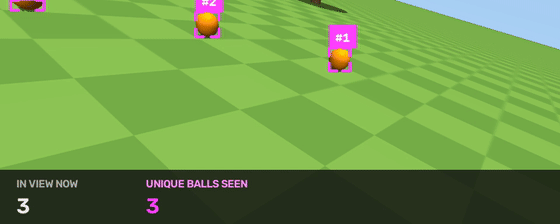
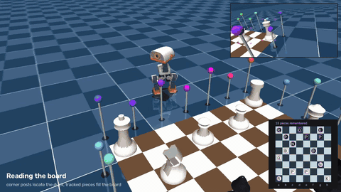

# microduck-tracking

Multi-object tracking powered by [`trackers`](https://github.com/roboflow/trackers)
for the [Microduck](https://github.com/pollen-robotics/microduck).


## Why tracking

Microduck ships per-frame detection with no identity: two identical balls are just
two boxes, every frame. In this demo an owner's hand throws one more identical ball
into the scene, and the thrown one is singled out purely by its track's velocity.
The duck locks that ID, fetches exactly that ball past the identical distractors,
and re-locks after every throw. "The ball that was just thrown" only exists as a
track.

## Quickstart

```bash
pip install trackers

pip install -r requirements.txt
git clone https://github.com/pollen-robotics/microduck_rl  # verified at d424a0c

mkdir -p policies && cd policies
for f in alpha_walking alpha_stand ball_kick_left ball_kick_right alpha_ground_pick; do
  curl -sLO "https://huggingface.co/pollen-robotics/microduck-policies/resolve/main/$f.onnx"
done
cd ..

python minimal_tracking.py
python demos/fetch_demo.py

pip install rfdetr
DETECTOR=rfdetr python demos/fetch_demo.py
```

Tracking is four lines:

```python
from trackers import SORTTracker
from trackers.utils.iou import BIoU

tracker = SORTTracker(frame_rate=50.0, iou=BIoU(buffer_ratio=2.0))
tracked = tracker.update(detections)
```

`detections` is an `sv.Detections` from any detector, and `tracked.tracker_id`
carries a stable id per object. Other trackers and options are in the
[trackers docs](https://trackers.roboflow.com).

[`minimal_tracking.py`](minimal_tracking.py) wires that seam into the MuJoCo
simulator: head-camera frames in, ids out.


[`demos/fetch_demo.py`](demos/fetch_demo.py) is the full fetch choreography.
Its `main()` holds the loop: detect, track, decide, step. Around it,
[`detection.py`](demos/detection.py) finds the balls,
[`policy.py`](demos/policy.py) turns tracks into motor commands, and
[`scene/`](demos/scene) is the world: the robot and its park, the owner's
hand, and the rendering.
[`demos/duck_tracking.py`](demos/duck_tracking.py) swaps in `duck_detect.onnx`,
the single-class YOLO the robot ships on its NPU.


[`demos/counting.py`](demos/counting.py) counts: six balls on an arc wider than
the lens, never more than four in frame at once, one head sweep, six ids. The
sweep only goes one way, because SORT associates on motion alone, so a ball
that leaves the view and comes back returns as a new id.



## Giant chess



[`demos/giant_chess_demo.py`](demos/giant_chess_demo.py): the duck reads a
duck-scale board through its own camera, keeps a board in memory, has
python-chess pick a legal one-square move, walks to the piece and kicks it one
square. Nothing the duck decides on comes from the simulator; it is used only
to score the run. In the shipped run it made all three moves it chose,
standing 10, 17 and 44 mm from the planned spot, and its remembered board
matched the true one, 15 of 15. When the best next move is the same piece one
square on, it kicks again from where it stands instead of walking out to read.

**Seeing.** Twenty-four marker posts around the board, seven per edge at two
heights with the corners shared, give the duck its own pose by PnP (1 to 5 mm
with the board in view) and put every piece on a square: the crown of a turned
piece sits on its axis at a known height, so the ray through it meets that
height at the piece's centre. Pieces are remembered by identity, on the square
most of their recent sightings agree on, so a piece out of view stays where it
was last seen, a sighting that cannot be placed is not evidence it is gone, and
a kick that was not seen to move the piece leaves the memory alone.

**Walking and kicking.** The gait cannot inch: a 0.6 s creep moves 14 mm one
time and 56 mm the next, and nothing under 0.6 s moves it at all. So the walk
is coarse until the piece is in view, then homes in on the piece and stops
early, and closes the rest with calibrated steps (a 1 s creep is 57 to 64 mm,
a 0.7 s creep with a small turn command 44 mm, three trials each). The kick
policy is run at twice its action scale on a wide flat-based piece, which
launches it one square and leaves it standing; measured, it lands the piece
with the foot spot anywhere from 15 mm past to 8 mm short of it and 30 mm to
either side. Creeping in turns the duck up to 30 degrees, and a kick 30
degrees off the file lands the piece on the corner of the square, so before
kicking the duck squares up on the posts under closed loop: open-loop turns
are not repeatable (the same 0.8 s command turned 2 to 30 degrees), a
negative yaw command alone does nothing, and walking away from the board
there is no post in view, so the duck leaves on dead reckoning.

Honest limits: moves are one-square and orthogonal, from stands on rank 1 or
2; piece type comes from the segmentation buffer in place of a detector; a
piece lands within about 40 mm of the square's centre, not on it; across our
runs the duck made two to three moves in three. An opening from the starting
position is out of reach with a kick: rank 1 is full, so there is no stand
behind any pawn, and pushing with the body was measured too (the duck stalls
against the piece, 1 to 3 mm in 3 s). That waits on the beak.

## How it works

**Policies.** Pollen's own `PolicyInference` runner and pretrained ONNX policies,
unmodified, at 50 Hz.

**Detection.** RF-DETR Nano on the head-camera frames (`DETECTOR=rfdetr`), or the
segmentation renderer as a perfect-detector stand-in.

**Tracking.** `SORTTracker` at the full 50 Hz camera rate with
`BIoU(buffer_ratio=2.0)`: the walking head-bob moves a small ball box more than its
own width between frames, and buffered IoU is what holds identity through it.

**Target selection.** Each track keeps an EMA of its box-center speed in image
space. After a throw releases, the duck locks the fastest track. It stands still
through the throw, so image speed alone identifies the thrown ball.

**Navigation.** From the camera image and the tracked ball's position in it, the
duck works out which way to turn and how far away the ball is, and walks there:
bearing from the box centre, range from the box's apparent diameter against the
ball's known 70 mm. The track says which detection is ours and the detection
says where it is, so nothing is measured from a track coasting on its Kalman
prediction. Simulator state reaches the owner's hand, never the duck.

Both detectors stop resolving the ball at about 0.19 m, so after its last
sighting the duck walks one fixed 0.55 s step before ducking. That length comes
from counting frames of beak-to-ball contact against a ball placed at known
offsets: at 0.14 m the beak only grazes it, at 0.08 to 0.12 m it lands on it
properly, and at 0.06 m the ankles reach the ball first and kick it away. The
step aims for the middle of that band.

Across six randomised seeds, eleven throws, the duck pecked and moved the ball
on seven, contact confirmed from the simulator's own contact list rather than by
eye. Those seven land 0.110 to 0.137 m from it. The four failures share a cause:
the last range fix came off a lookalike instead of the target, so the duck
commits its blind step on a bad number and pecks 0.13 to 0.75 m short. Spacing
the lookalikes further apart hides that, at the cost of the thing the demo is
for. One thing the POV
inset does not show is the moment of contact: Pollen mount the lens low and
behind the beak, so the peck swings the camera through the ball and the view
goes briefly empty. Moving the camera forward fixes it and stops it being this
robot's camera, so it stays where it is. Reproduce with
`THROW_SEED=<n> TRIAL=1 HEADLESS=1 python demos/fetch_demo.py`. That is with the
segmentation stand-in; RF-DETR is weaker here, padding boxes and often missing
the ball in flight, so the duck sometimes never re-locks after a throw. The lock
has no fallback for that on purpose: every fallback we tried locked onto
detector flicker, and fetching the wrong ball is worse than fetching none.

## Does it fit the real robot?

Yes. SORT costs 73 to 76 µs per update on an Apple M4 over the demo's real cached
detections, an estimated 2 to 4.5 ms on Microduck's Cortex-A55, next to the ≈60 ms
its detector already spends on a look: ≈15 Hz tracked detection end to end.
Measurements in [hardware-feasibility.md](benchmark/hardware-feasibility.md).

## Acknowledgements

Simulator, policies, and the Microduck itself are by
[Pollen Robotics](https://github.com/pollen-robotics) and Hugging Face.
