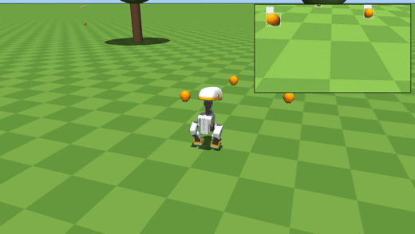

# microduck-tracking

Multi-object tracking for the [Microduck](https://github.com/pollen-robotics/microduck)
biped, built on [`trackers`](https://github.com/roboflow/trackers). Microduck ships
per-frame object detection (a single-class YOLO11n on its NPU) with no notion of
identity across frames. This project adds that identity in the robot's own MuJoCo
simulator, running its real pretrained policies, and shows behavior that only exists
once objects have stable IDs: locking onto one specific ball among identical ones and
playing fetch with it.

If this is useful, the tracking layer is the library:
[roboflow/trackers](https://github.com/roboflow/trackers), `pip install trackers`.



Full clip with both fetch cycles: [assets/fetch_demo.mp4](assets/fetch_demo.mp4).

## What the demo shows

The duck stands among identical orange balls. An animated owner's hand lobs one more
identical ball into the scene. Every ball carries a track ID from `SORTTracker`; the
thrown one is singled out purely by its track's image-space velocity, with no simulator
ground truth. The duck locks that ID, walks to exactly that ball past the identical
distractors, worries it with its beak, and waits while the hand retrieves the ball and
throws again. "The ball that was just thrown" only exists as a track. No detector can
express it.

## Quickstart

```bash
pip install -r requirements.txt

git clone https://github.com/pollen-robotics/microduck_rl

mkdir -p policies && cd policies
for f in alpha_walking alpha_stand ball_kick_left ball_kick_right alpha_ground_pick; do
  curl -sLO "https://huggingface.co/pollen-robotics/microduck-policies/resolve/main/$f.onnx"
done
cd ..

python minimal_tracking.py
python fetch_demo.py
DETECTOR=rfdetr python fetch_demo.py
```

[`minimal_tracking.py`](minimal_tracking.py) is the integration seam in ~70 lines:
head-camera frames in, `sv.Detections` through `SORTTracker`, IDs out. Start there to
add tracking to your own Microduck project. [`fetch_demo.py`](fetch_demo.py) is the
full fetch choreography and writes `fetch_demo.mp4`. `SIM_SECONDS` sets the length,
`DEBUG_LOG=1` prints per-frame tracking state, and `MICRODUCK_RL` /
`MICRODUCK_POLICIES` override the default sibling-directory locations.

## How it works

**Control.** All robot behavior is Pollen's own `PolicyInference` runner, imported from
`microduck_rl`, executing their pretrained ONNX policies (walking, standing, ground
pick) at 50 Hz. Nothing about the robot stack is modified.

**Camera.** The MJCF head camera points backward with a 90 degree roll from inside the
jaw mesh. The demo re-aims it forward via `MjSpec`, pitches it 25 degrees down, and
widens it to a 90 degree field of view.

**Detection.** `DETECTOR=rfdetr` runs RF-DETR Nano on the rendered head-camera frames.
The default uses the simulator's segmentation renderer as a perfect-detector stand-in.
Control-side ball identification always uses the segmentation boxes, so the detector
choice only changes what the tracker sees.

**Tracking.** `SORTTracker` runs at the full 50 Hz camera rate with
`BIoU(buffer_ratio=2.0)`. The walking head-bob moves a 10 px ball box more than its own
width between frames, which breaks plain IoU association. Buffered IoU expands the
boxes before matching and holds identity through the bob and at long range.

**Target selection.** Every confirmed track keeps an exponential moving average of its
box-center speed in image space. After each throw releases, the duck locks the fastest
track above 4 px/frame. It stands still through the whole throw, so egomotion is
negligible and image speed alone identifies the thrown ball. The beak touch uses the
pretrained blind ground pick; a lift grid test (three ball sizes, three positions)
confirmed the beak cannot hold a 70 mm ball, so the touch is the play.

## Does it fit the real robot?

Yes. [hardware-feasibility.md](hardware-feasibility.md) has the measured review for
Microduck's RK3566: SORT costs 43 to 291 microseconds per update on an M-series laptop
(1 to 16 objects, `bench_tracker.py`), an estimated 1.5 to 7 ms on the robot's
Cortex-A55 cores, next to the ~60 ms its NPU detector already spends per frame. The
end-to-end tracked-detection rate works out to ~14 Hz. RF-DETR Nano measured 198 ms
even on an RK3588 NPU+CPU split, so on this hardware the recipe is: keep the YOLO-class
NPU detector, add `trackers` for identity.

## Acknowledgements

The simulator, robot policies, and the Microduck itself are by
[Pollen Robotics](https://github.com/pollen-robotics) and Hugging Face. This repo adds
the tracking layer and the fetch choreography.
