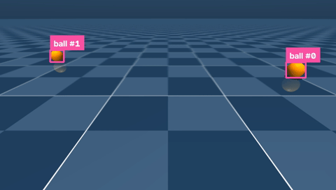
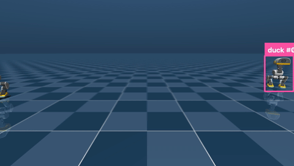

# microduck-tracking

Multi-object tracking powered by [`trackers`](https://github.com/roboflow/trackers)
for the [Microduck](https://github.com/pollen-robotics/microduck).


## Why tracking

Microduck ships per-frame detection with no identity: two identical balls are just
two boxes, every frame. In this demo an owner's hand throws one more identical ball
into the scene, and the thrown one is singled out purely by its track's velocity.
The duck locks that ID, fetches exactly that ball past the identical distractors,
and re-locks after every throw. "The ball that was just thrown" only exists as a
track.

## Quickstart

```bash
pip install trackers

pip install -r requirements.txt
git clone https://github.com/pollen-robotics/microduck_rl

mkdir -p policies && cd policies
for f in alpha_walking alpha_stand ball_kick_left ball_kick_right alpha_ground_pick; do
  curl -sLO "https://huggingface.co/pollen-robotics/microduck-policies/resolve/main/$f.onnx"
done
cd ..

python minimal_tracking.py
DETECTOR=rfdetr python demos/fetch_demo.py
```

[`minimal_tracking.py`](minimal_tracking.py) is the integration seam in ~70 lines:
frames in, `sv.Detections` through `SORTTracker`, IDs out. Copy it into your own
project. [`fetch_demo.py`](demos/fetch_demo.py) is the full fetch choreography.



[`duck_tracking.py`](demos/duck_tracking.py) tracks other microducks through
`duck_detect.onnx`, the exact single-class YOLO the robot ships on its NPU.



## How it works

**Control.** Pollen's own `PolicyInference` runner and pretrained ONNX policies,
unmodified, at 50 Hz.

**Detection.** RF-DETR Nano on the head-camera frames (`DETECTOR=rfdetr`), or the
segmentation renderer as a perfect-detector stand-in.

**Tracking.** `SORTTracker` at the full 50 Hz camera rate with
`BIoU(buffer_ratio=2.0)`: the walking head-bob moves a small ball box more than its
own width between frames, and buffered IoU is what holds identity through it.

**Target selection.** Each track keeps an EMA of its box-center speed in image
space. After a throw releases, the duck locks the fastest track. It stands still
through the throw, so image speed alone identifies the thrown ball.

## Does it fit the real robot?

Yes. SORT costs an estimated 1.5 to 7 ms on Microduck's Cortex-A55, next to the
~60 ms its NPU detector already spends per frame: ~14 Hz tracked detection
end to end. Measurements in [hardware-feasibility.md](benchmark/hardware-feasibility.md).

## Acknowledgements

Simulator, policies, and the Microduck itself are by
[Pollen Robotics](https://github.com/pollen-robotics) and Hugging Face.
